# MLOPS AUTOMATION


### MLOPS = MACHINE LEARNING on DEVOPS


# Project on integration of Machine Learning  with Jenkins & Docker 

This project is based on the the automation of machine lerning model , when it'll be integrated with docker & jenkins. Bascially to create a machine learning model  is not a tough task as we've to run it  , or trained it & find the accuracy all these things we can find easily with the automation process. we have to only define the job in jenkins according to the our requirements & use cases.


# Feature of Project

  1. Create container image that’s has Python3 and Keras or numpy  installed  using dockerfile 

  2. When we launch this image, it should automatically starts train the model in the container.

  3. Create a job chain of job1, job2, job3, job4 and job5 using build pipeline plugin in Jenkins 

  4.  Job1 : Pull  the Github repo automatically when some developers push repo to Github.

  5.  Job2 : We've to the build the our **own docker image** according the our code ( that docker image has been created by me though the **Dockerfile** inside that we've to write the all the libraries required for that code ).

  6.  Job3 : We've to launch the container in docker according to our CNN code.

  7.  Job4 : We,ve to run the CNN code inside our docker & find the **Accuracy** of the model.

  8.  Job5 : We,ve to send the notification to the developer if accuracy of the model is more than 80%.


# DESCRIPTION OF PROJECT

firstly i write the python code for CNNN model in jupyter notebook & after that i download that code in to **.py extension**  & then copy this code into a seperate folder or directory inside the **RHEL8** operating system with the help of **Winscp software**. After that i upload this code on **GitHub** where i created a repository for the same & initialize this repository in githu


After that i launch my **RHEL8** operating systemtcreate the seperate **workspace** to work on this project & & create A docker file with command 
```
vim Dockerfile  

```
inside this file i used centos: latest version as my base image & install all the required libraries to run the CNN code .

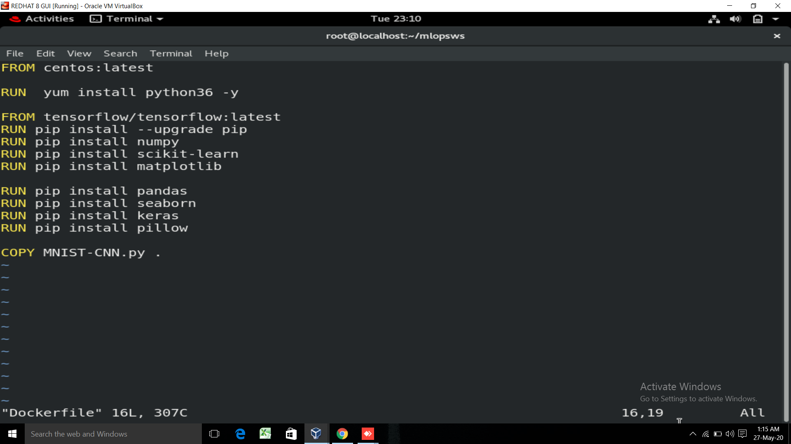

######  CODE For Dockerfile:

```

FROM centos:latest

RUN yum install python36 -y 

RUN pip install --upgrade pip 

From tensorflow/tensorflow:latest

RUN pip install numpy

RUN pip install scikit-learn

RUN pip imnstall matplotlib

RUN pip imnstall pandas

RUN pip imnstall seaborn

RUN pip installl keras

RUN pip imnstall pillow

FROM MNIST-CNN.py

```

After that i start jenkins where i create the chain of job to run the all the processs automatically.

  - Job1 : Pull  the Github repo automatically when some developers push repo to Github.
  
  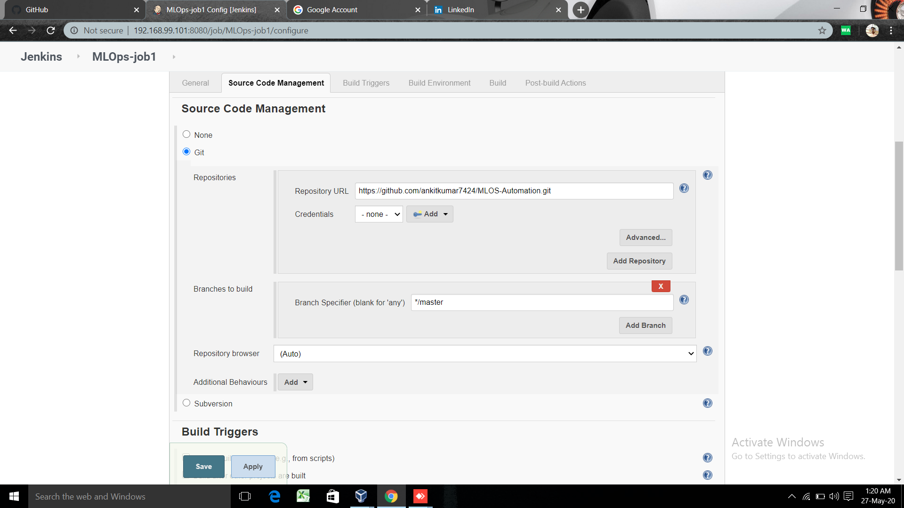
  
  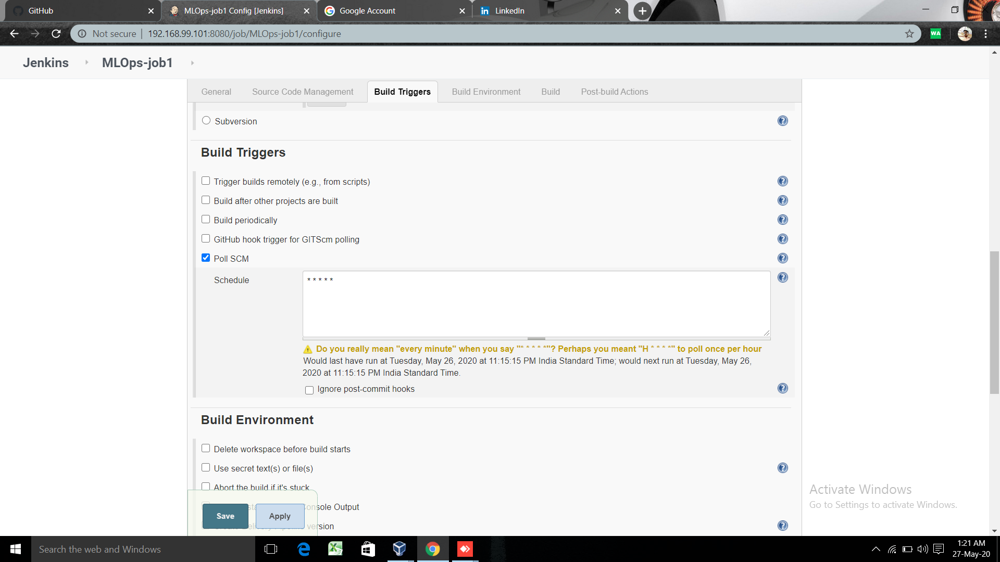
  
  
  
  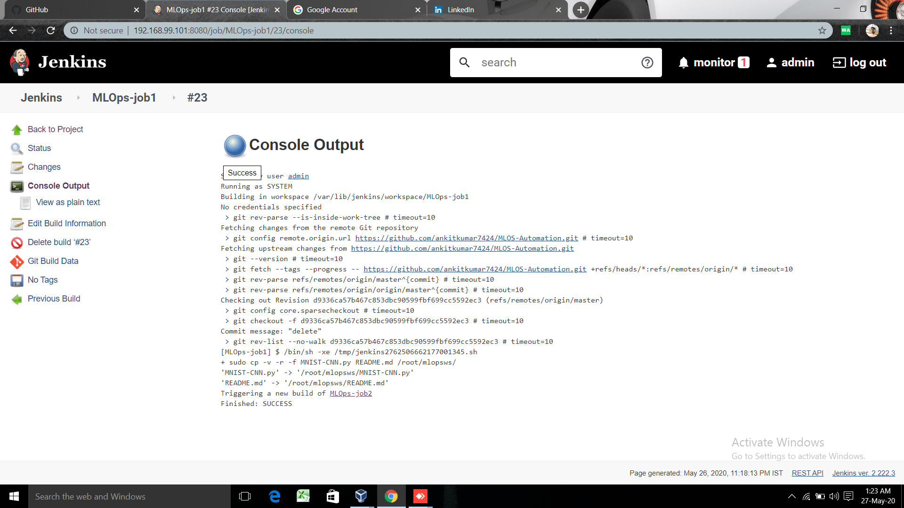

  - Job2 : We've to the build the our **own docker image** according the our code ( that docker image has been created by me though the **Dockerfile** inside that we've to write the all the libraries required for that code ).
  
  
   
   
   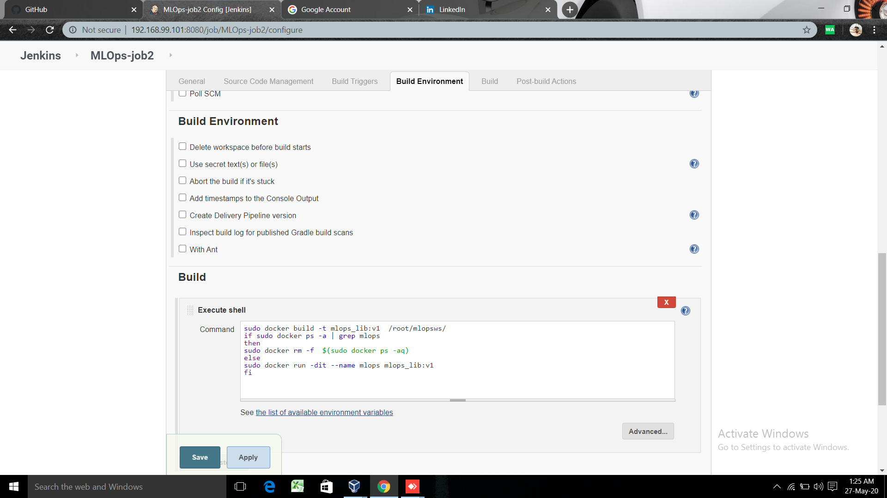
   
   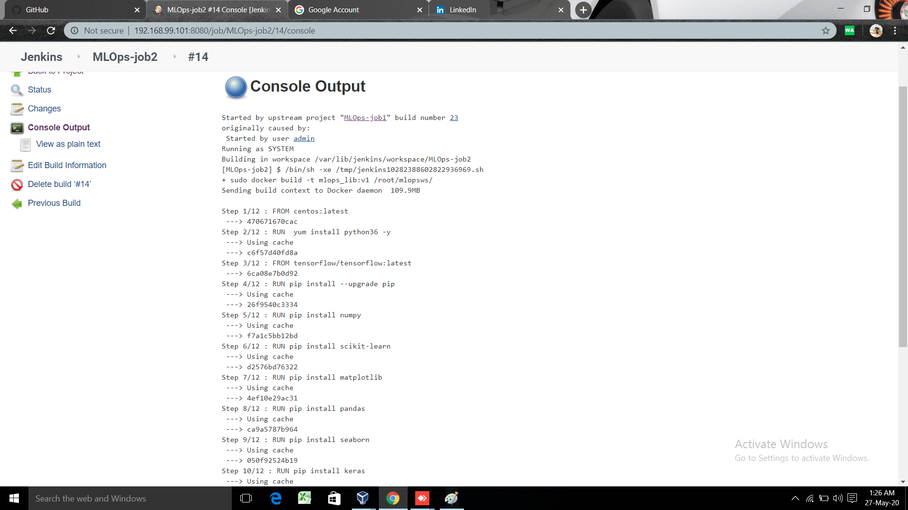
   
   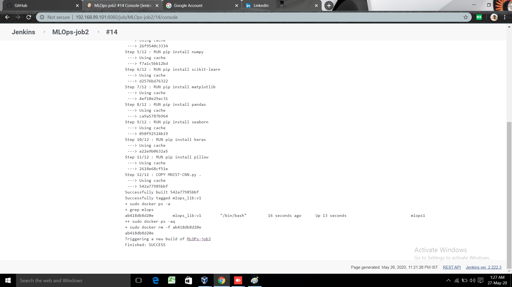
   
   
 - Job3 : We've to launch the container in docker according to our CNN code.
 
  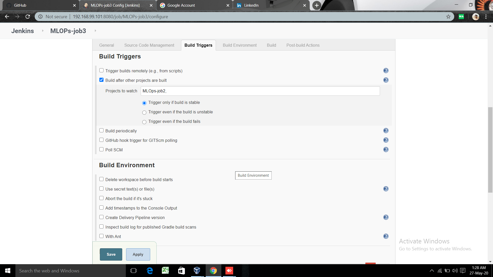
  
  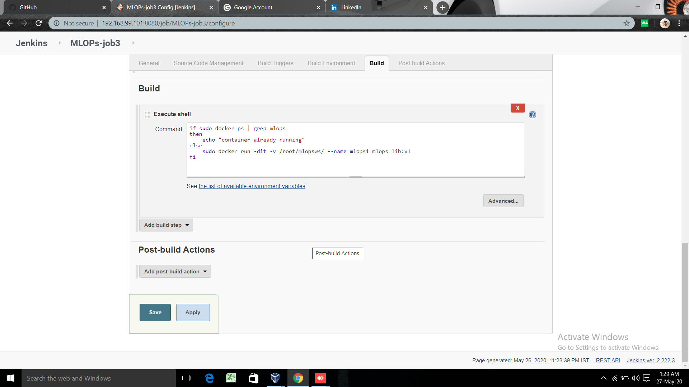

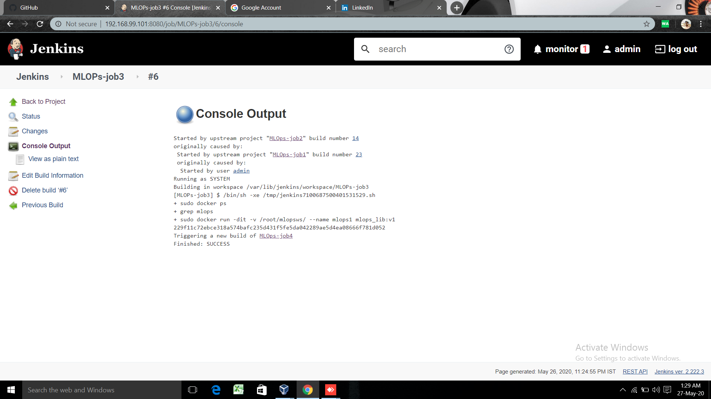

 -  Job4 : We,ve to run the CNN code inside our docker & find the **Accuracy** of the model.
 
  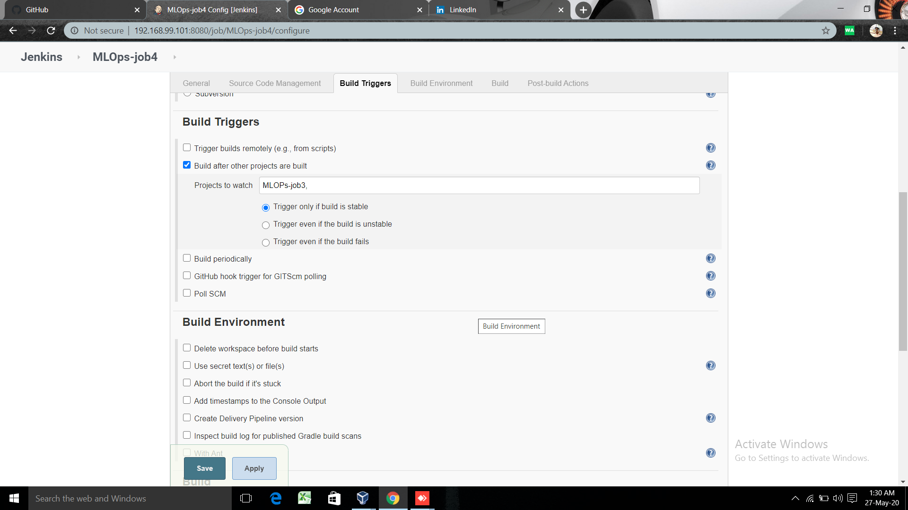
  
   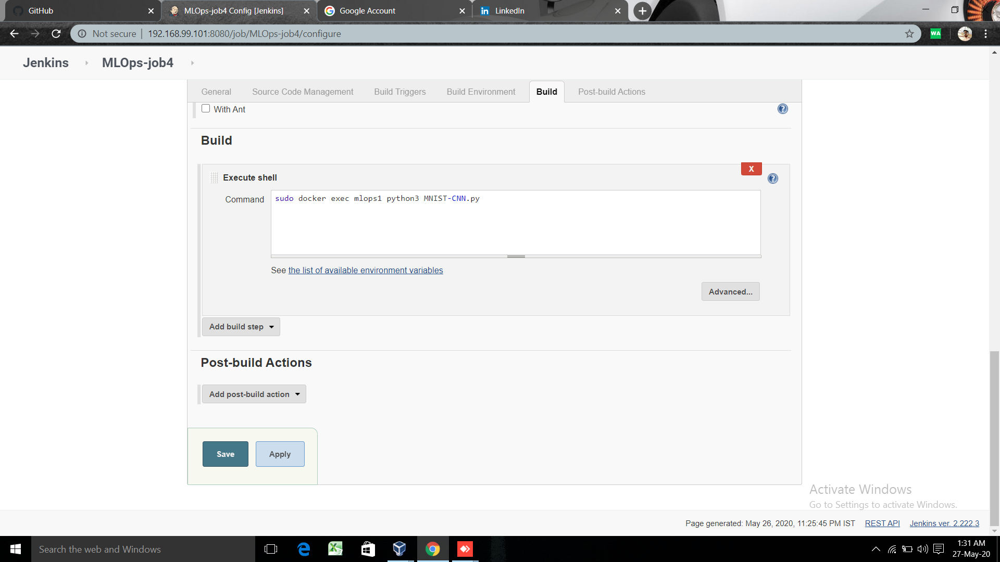
   
   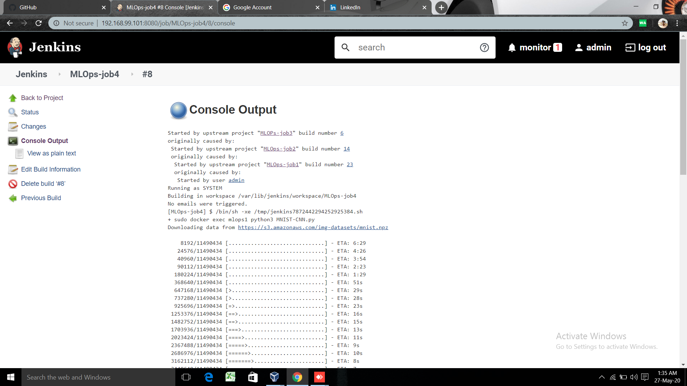
   
    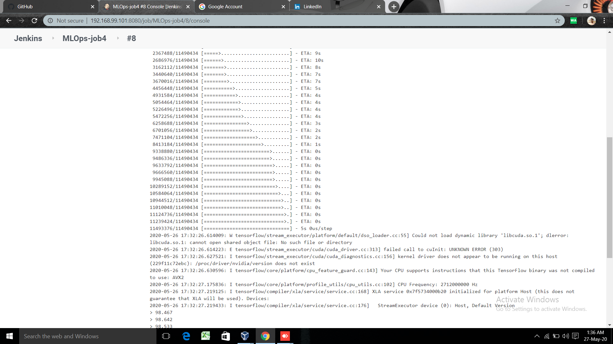
    
     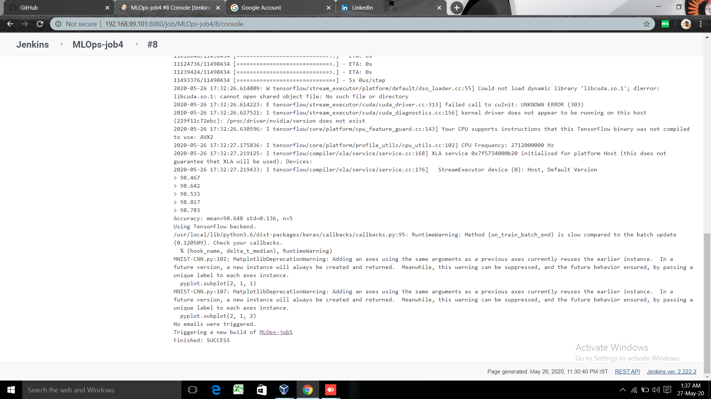
     
 -  Job5 : We,ve to send the notification to the developer if accuracy of the model is more than 80%
 
  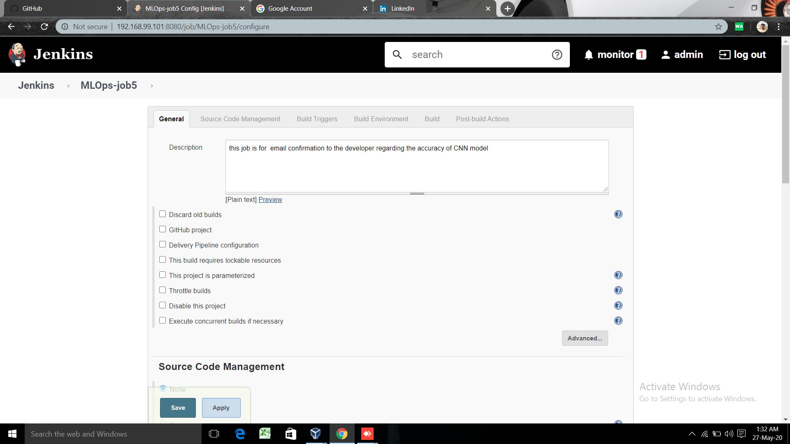
  
   
   
    
    
   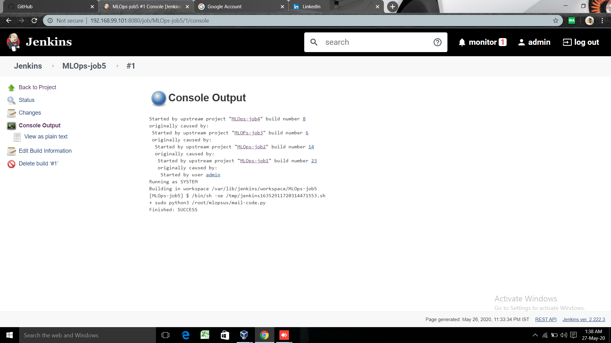
